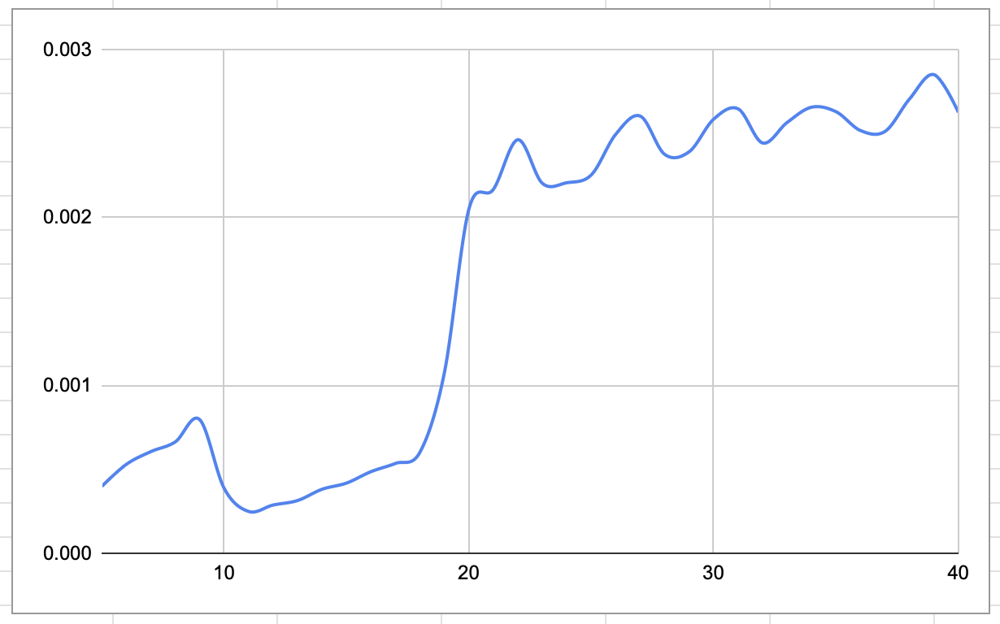

# 피보나치 기반 GCD 복잡도 분석

## 1
피보나치 수열 F(n)에 대해 GCD(F(n), F(n-1))을 계산하며 실행 시간을 측정하고
유클리드 호제법의 시간 복잡도 O(log n)를 검증한다.

---

## 2
- n을 5부터 증가시키며 반복 수행
- 각 n에 대해 F(n), F(n-1)을 계산
- GCD(F(n), F(n-1)) 수행 시간 측정
- time.h의 clock() 함수를 이용하여 CPU 실행 시간을 측정

---

## 실행 코드

```
#include <stdio.h>
#include <time.h>

// GCD 함수
int gcd(int a, int b) {
    while (b != 0) {
        int temp = a % b;
        a = b;
        b = temp;
    }
    return a;
}

// 피보나치 (반복문)
int fib(int n) {
    if (n <= 1) return n;
    int a = 0, b = 1, temp;
    for (int i = 2; i <= n; i++) {
        temp = a + b;
        a = b;
        b = temp;
    }
    return b;
}

int main() {
    for (int n = 5; n <= 40; n++) {
        int fn = fib(n);
        int fn1 = fib(n - 1);

        clock_t start = clock();

        for (int i = 0; i < 10000; i++) {
            gcd(fn, fn1);
        }

        clock_t end = clock();

        double time_taken = (double)(end - start) / CLOCKS_PER_SEC;

        printf("%d %f\n", n, time_taken);
    }
    return 0;
}
```

## 4. 실행 결과 

```
5   |  0.000398
6   |  0.000529
7   |  0.000605
8   |  0.000663
9   |  0.000796
10  |  0.000387
11  |  0.000249
12  |  0.000287
13  |  0.000314
14  |  0.000381
15  |  0.000418
16  |  0.000486
17  |  0.000535
18  |  0.000602
19  |  0.001077
20  |  0.002050
21  |  0.002168
22  |  0.002463
23  |  0.002204
24  |  0.002207
25  |  0.002254
26  |  0.002496
27  |  0.002604
28  |  0.002376
29  |  0.002392
30  |  0.002586
31  |  0.002647
32  |  0.002444
33  |  0.002566
34  |  0.002657
35  |  0.002630
36  |  0.002518
37  |  0.002513
38  |  0.002706
39  |  0.002851
40  |  0.002626
```

## 5. 그래프 이미지


## 6. 결과 분석
n이 증가함에 따라 실행 시간이 전반적으로 증가  
: 전체적으로 완만한 증가 형태를 보이며, 이는 유클리드 호제법의 시간 복잡도가 O(log n)임을 확인할 수 있다.

## 7. Big-O 검증
본 실행 결과, GCD 알고리즘의 시간 복잡도가 O(log n)과 일치  
따라서 1번에서 분석한 시간 복잡도를 검증할 수 있다.