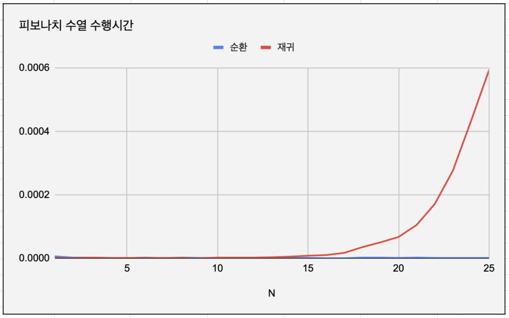

## 과제(8)
- 피보나치 수열 순환적 방법 / 재귀적 방법

## 정의 
피보나치 수열을 순환적 방법과 재귀적 방법으로 계산하고, 입력 크기 (N)을 증가시키면서 각 방법의 수행시간을 측정하여 비교한다.

피보나치 수열의 값은  F(1)=1, F(2)=1, F(3)=2... 로 정의한다.

## 구현 방법 

### 1. 순환적 방법
- 반복문(for문)을 사용하여 피보나치 수열을 계산 : 이전 두 값을 이용하여 다음 값을 계산하는 방식

### 2. 재귀적 방법
- 함수가 자기 자신을 호출하는 방식으로 피보나치 수열을 계산 (단, 동일한 값이 여러 번 계산되는 중복 호출 발생)

```
입력 값(N)을 1부터 증가시키며 수행시간을 측정
: clock() 함수를 사용하여 각 방법의 실행 시간을 측정하였다.
```

## 실행 결과 (코드는 .c 파일 제출)
N 입력 값: 30
```
N | fib_순환 | fib_재귀 |  순환_수행  | 재귀_수행
1 |    1    |    1    | 0.000007 | 0.000001
2 |    1    |    1    | 0.000001 | 0.000000
3 |    2    |    2    | 0.000000 | 0.000001
4 |    3    |    3    | 0.000002 | 0.000001
5 |    5    |    5    | 0.000000 | 0.000001
6 |    8    |    8    | 0.000000 | 0.000000
7 |    13   |    13   | 0.000001 | 0.000000
8 |    21   |    21   | 0.000001 | 0.000002
9 |    34   |    34   | 0.000002 | 0.000002
10 |    55  |    55   | 0.000001 | 0.000002
11 |    89  |    89   | 0.000001 | 0.000002
12 |    144   |    144  | 0.000001 | 0.000003
13 |    233   |    233  | 0.000002 | 0.000004
14 |    377   |    377  | 0.000000 | 0.000006
15 |    610   |    610  | 0.000001 | 0.000008
16 |    987   |    987  | 0.000002 | 0.000014
17 |    1597   |    1597  | 0.000001 | 0.000022
18 |    2584   |    2584  | 0.000000 | 0.000034
19 |    4181   |    4181  | 0.000001 | 0.000054
20 |    6765   |    6765  | 0.000000 | 0.000085
21 |    10946  |    10946  | 0.000002 | 0.000137
22 |    17711  |    17711  | 0.000001 | 0.000217
23 |    28657  |    28657  | 0.000001 | 0.000351
24 |    46368  |    46368  | 0.000002 | 0.000567
25 |    75025  |    75025  | 0.000000 | 0.000717
26 |    121393  |    121393  | 0.000000 | 0.001160
27 |    196418  |    196418  | 0.000001 | 0.001600
28 |    317811  |    317811  | 0.000000 | 0.003923
29 |    514229  |    514229  | 0.000001 | 0.005682
30 |    832040  |    832040  | 0.000002 | 0.008026

```

## 그래프 이미지

순환적 방법은 수행 시간이 매우 작아 그래프에서 거의 0에 가깝게 나타나지만, 
재귀적 방법은 입력 값이 증가함에 따라 급격히 증가하여 두 방법 간의 성능 차이를 확인할 수 있다.

## 분석 및 비교
1. 순환적 방법은 반복문을 사용하기 때문에 입력 크기(N)이 증가함에 따라 수행 시간이 선형적으로 증가하는 모습을 볼 수 있다.

2. 재귀적 방법은 동일한 값을 여러 번 계산하는 중복 호출이 발생하여 수행 시간이 지수적으로 증가하는 모습을 볼 수 있다. 
-> N이 커질수록 재귀적 방법의 실행시간이 급격히 증가하는 것을 확인 

```
순환적 방법은 반복문을 사용하여 이전 두 값을 기반으로 다음 값을 한 번만 계산하는 방식이다. 
따라서 불필요한 중복 연산이 발생하지 않으며, 입력 크기 (N)이 증가함에 따라 수행시간이 선형적으로 증가하는 경향을 보였다. 
이는 시간 복잡도가 O(n)이기 때문이며, 효율적인 것을 알 수 있다.

재귀적 방법은 함수가 자기 자신을 호출하는 구조로, 동일한 값을 여러 번 계산하는 중복 호출이 발생한다. 
이로 인해 전체 함수 호출 횟수가 급격히 증가하며, 입력 값(N)이 커질수록 수행 시간이 지수적으로 증가하는 모습을 보인다. 
이는 시간 복잡도 O(2ⁿ)에 해당하며, 비효율적인 것을 알 수 있다.

두 방법을 비교해보면, 입력 값이 작을 때는 수행 시간의 차이가 크지 않지만 입력 값이 증가할수록 재귀적 방법이 비효율적이라는 것을 알 수 있다. 
실제로 수행 결과, 일정 값 이상 (N)에서는 재귀적 방법의 실행시간이 급격히 증가하여 사용하기 어려웠다.

따라서 중복 계산이 많은 피보나치 수열에서는 재귀적 방법보다 순환적 방법이 더 효율적이라는 것을 알 수 있다.
```